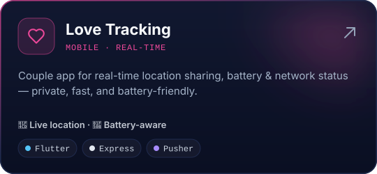
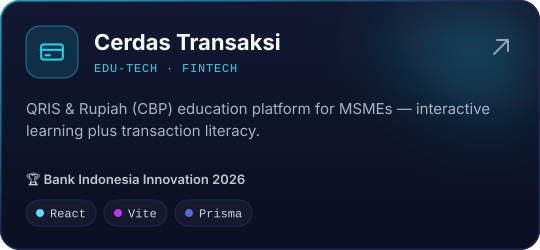
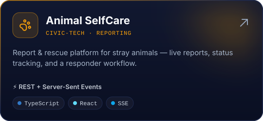
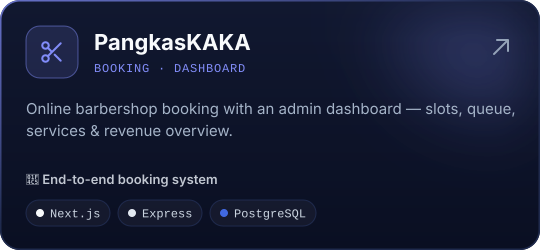
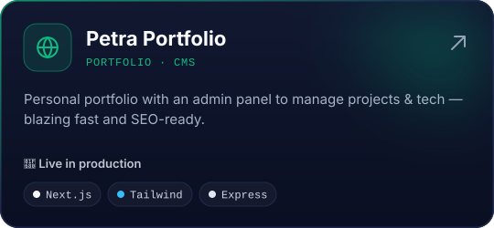
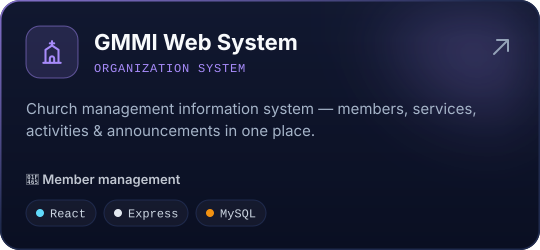

<!-- Visual assets are generated: `node scripts/build-assets.mjs` (static) and the "Generate profile assets" workflow (activity dashboard + snake). -->

  
  
  
  
  

 

I'm a **full-stack developer from Indonesia** who turns ideas into production-ready products — from booking platforms and real-time tracking to admin dashboards and edu-tech. I care about clean architecture, fast execution, and building things people actually use.

> [!TIP]
> 🔭 **Currently exploring** MLOps, Prometheus + Grafana and PostGIS &nbsp;·&nbsp; 🏆 **Bank Indonesia Innovation 2026** with *Cerdas Transaksi* &nbsp;·&nbsp; 🤝 **Open to** freelance, collabs & remote roles

 

 

<b>FRONTEND</b> 

<b>BACKEND & DATABASE</b> 

<b>MOBILE</b> 

<b>TOOLS & DEVOPS</b> 

<b>EXPLORING</b> 

 

  
  
  
  
  
  

  
    <b>Backends →</b>
    <a href="https://github.com/Petra-Miracle/Love-Tracking-BACKEND">Love Tracking</a> ·
    <a href="https://github.com/Petra-Miracle/Animal-SelfCare-BE">Animal SelfCare</a> ·
    <a href="https://github.com/Petra-Miracle/PangkasKAKA-Backend">PangkasKAKA</a> ·
    <a href="https://github.com/Petra-Miracle/Petra-Portfolio-Backend">Portfolio</a>
  
    
  

 

<picture>
  <source media="(prefers-color-scheme: dark)" srcset="https://raw.githubusercontent.com/Petra-Miracle/Petra-Miracle/output/snake.svg" />
  
</picture>

 

  
  
  
  

